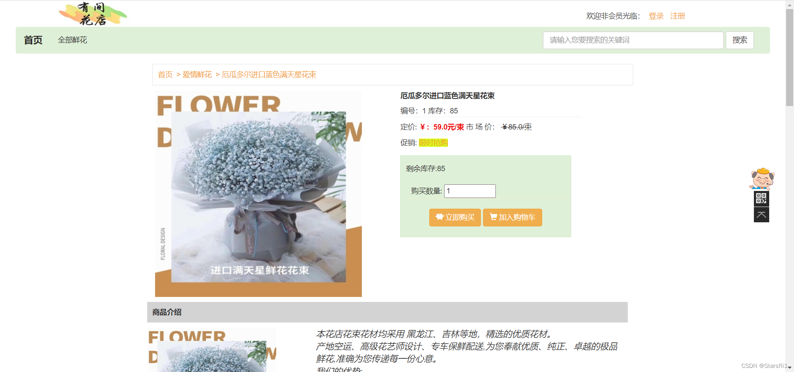
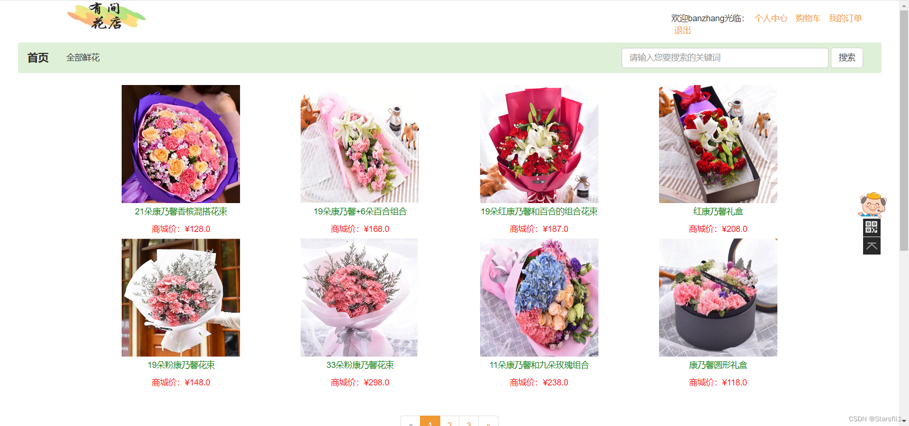
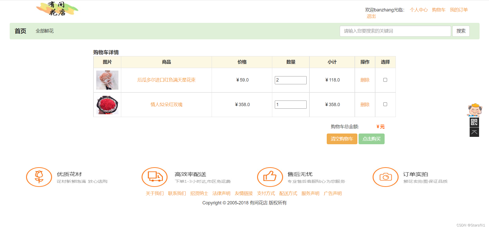
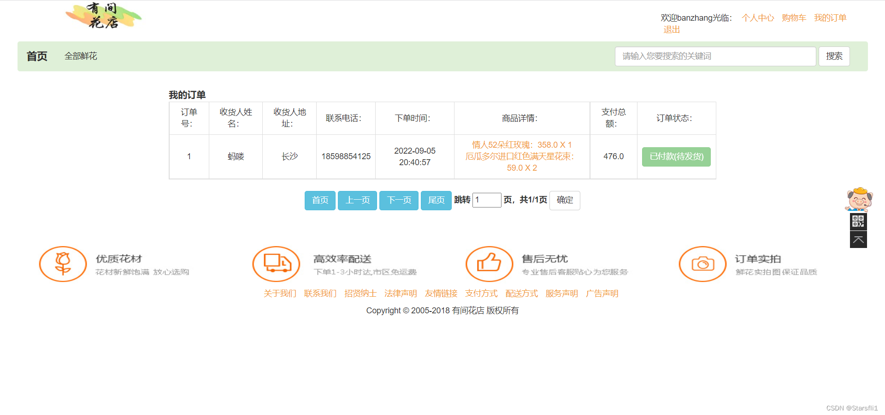
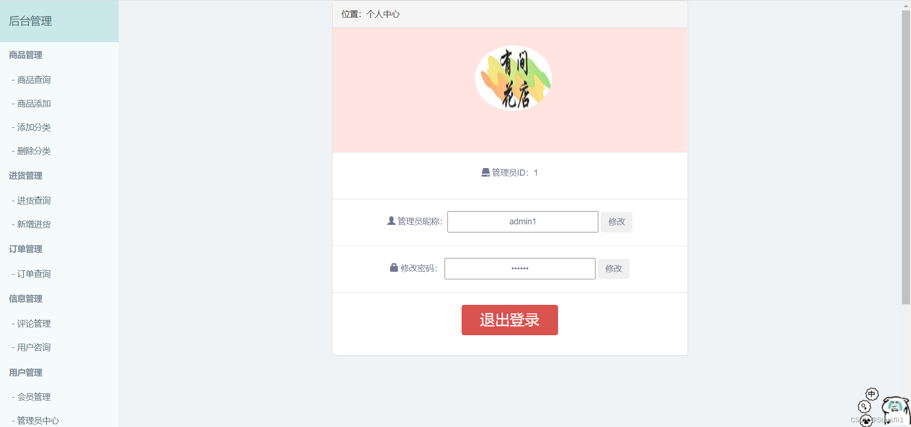

# 基于SSM+JSP的花店项目

#### 介绍
基于Idea开发的有间花店项目，非常适合实战练习项目和毕业设计项目

#### 项目技术
Spring+ SpringMVC + Mybatis + JSP +Maven

#### 安装教程
1.  Mysql5.7
2.  Maven
3.  JDK1.8

#### 使用说明
1.  运行SQl文件创建数据库
2.  配置一下Tomcat服务器
3.  然后直接运行

#### 运行效果图展示
登录页面：
首页:
商品详情页:
商品分类:
购物车:
我的订单:
后台管理页面：

#### 联系方式：
当前代码只是部分源码
如需项目全部源码和数据库文件请 **添加博主的wx或qq** （包括部署和运行教程）
 **wx：lyh38854** 
 **qq：1816026989** 